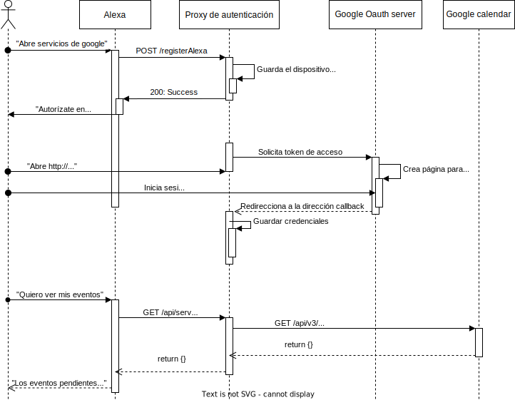

# Práctica 02 - Alexa skill

## Prerrequisitos

- node >= 18.12.1
- npm >= 8.19.2

## Cómo ejecutar

En caso de querer ejecutar el servidor como un servicio independiente:
```bash
$ npm install
$ npm run build
$ npm run start # El servidor estará escuchando en el puerto 3000
```
En caso de querer ejecutar el servidor como un contenedor de docker.
```
$ docker build . -t alexa-skill-proxy-server
$ docker run -d -p 3000:3000 alexa-server alexa-skill-proxy-server
```

## Diagrama de flujo
<div style="text-align:center;"></div>